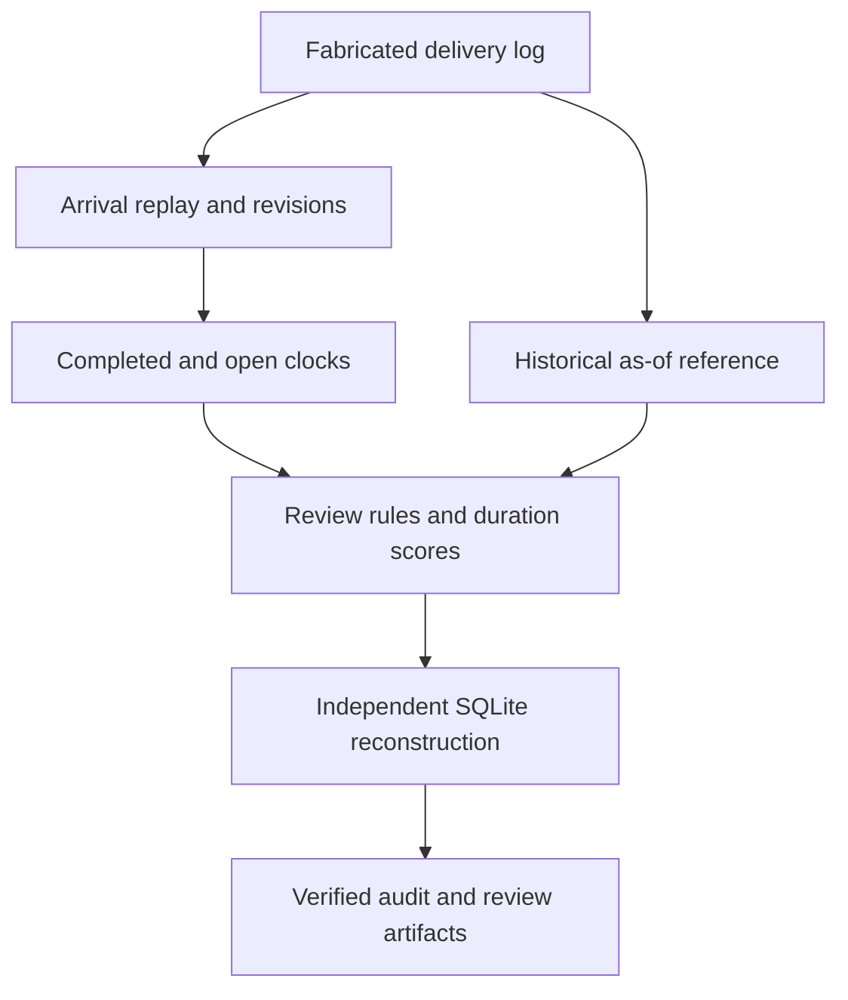

# Where the Clock Starts — Research Engineering Demonstration

**Public engineering companion for _Where the Clock Starts: Administrative Timeliness in a Multistage Public Program_.**

This repository demonstrates administrative-process data engineering with **fully synthetic records**. It does **not** contain the manuscript, private administrative data, real program identifiers, empirical estimates, bootstrap outputs, private provenance, or the complete scientific workflow.

## What this repository demonstrates

The upgrade adds deterministic **offline event-stream replay and process anomaly detection** alongside the original case/stage checkpoint audit.

| Capability | Executable evidence |
|---|---|
| Event chronology | Separate event time, recorded arrival time, and explicit delivery sequence; timezone normalization and as-of snapshots |
| Revisable timelines | Idempotent duplicates, highest-revision projection, stale-revision handling, corrections and retractions |
| Late arrivals | Monotone watermark metadata; late updates retained and used to revise the case projection |
| Process clocks | Issue/notification starts, stage partitions, completed durations, and separately reported open-case ages |
| Anomaly detection | Ambiguous stages, missing predecessors, reversed clocks, withdrawn decisions, aged open cases, and frozen-reference duration candidates |
| Independent SQL | Raw-log reconstruction of both snapshots, revisions, watermarks, clocks, historical median/MAD profiles, scores and review rules |
| Review evidence | CSV queue, structured evidence, filtered HTML dashboard, source/artifact receipts and replay verification |

See [event-stream semantics](docs/event_stream_semantics.md), [anomaly detection](docs/process_anomaly_detection.md), [the validation record](docs/event_stream_validation_record.md), and [CV evidence](docs/cv_evidence.md).

## Engineering flow



## Quick start

```bash
python3 -m pip install -r requirements.txt
./run_all_demos.sh
```

The combined runner executes both demos and their tests. The original outputs remain under `outputs/`; the event replay writes `outputs/stream/`, including raw fabricated inputs, an ingestion ledger, effective event versions, case clocks, stage durations, a frozen baseline, duration scores, a review queue, SQL QA, and a searchable HTML review view.

Run or verify only the event-stream demonstration:

```bash
python3 -m event_stream.pipeline
python3 -m event_stream.pipeline --verify-only
python3 -m event_stream.pipeline --as-of 2026-01-25T00:00:00Z --output /tmp/earlier-process-snapshot
python3 -m pytest -q tests tests_stream
```

Local validation passed **89 tests** and **38 SQL checks** (12 original + 26 stream checks), with none skipped. The default fabricated log has 108 cases and 540 delivery rows; the observation snapshot consumes 539 and excludes one future arrival. A 60-case historical reference scores 42 later completed cases. The 18 review rows cover 11 cases and are rule-level candidates, not adjudications or a detector-accuracy estimate.

The runtime uses Python's standard library and SQLite; tests use pinned pytest. [Reproducibility](docs/reproducibility.md) includes Docker commands and hosted execution-status guidance.

## Public-safe boundary

The synthetic schema is intentionally generic. It demonstrates engineering patterns without exposing the private study's exact administrative variables, identifiers, sample counts, empirical estimates, inference results, or manuscript logic. The new log is fabricated by `event_stream/generator.py` and is independent of the original 12-row checkpoint fixture.

## Scientific boundary

This repository demonstrates **engineering capability only**. It does not establish administrative wrongdoing, legal delay, negligence, causal effects, program performance, or empirical findings from the private paper. The stream uses a declared toy single-pass stage path and synthetic thresholds. Repeated stages may be legitimate in an actual program; their ambiguity here requires review and does not establish error. No external detector accuracy or production deployment is demonstrated.

## Author

**Mahfuzur Rahman**

Copyright © Mahfuzur Rahman. All rights reserved.
